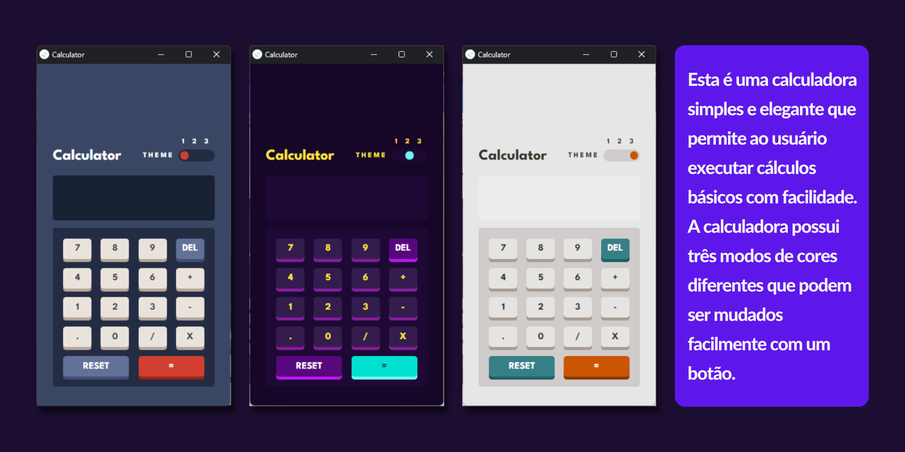
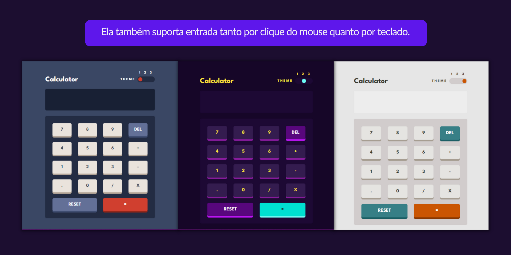
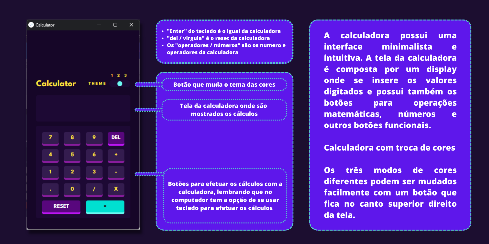

  <h1> Calculadora com troca de cores </h1>
  Tecnologias utilizadas: <a href="https://developer.mozilla.org/pt-BR/">HTML</a>, <a href="https://developer.mozilla.org/pt-BR/">CSS</a>, 
    <a href="https://developer.mozilla.org/pt-BR/docs/Web/JavaScript">JavaScript</a> e 
    <a href="https://jquery.com/">jquery</a>.

  
Esta é uma calculadora simples e elegante que permite ao usuário executar cálculos básicos com facilidade. 
    A calculadora possui três modos de cores diferentes que podem ser mudados facilmente com um botão, localizado no canto superios direito da tela. 
    Ela também suporta entrada tanto por clique do mouse quanto por teclado.

  
  

  <h1> Funcionalidades </h1>
  <ul>
    <li>Adição, subtração, multiplicação e divisão</li>
    <li>Entrada de números tanto por teclado quanto por clique do mouse</li>
    <li>Troca fácil de cores com um botão</li>
    <li>Limpeza de tela com um botão</li>
  </ul>
  <h1> Design </h1>
  
A calculadora possui uma interface minimalista e intuitiva. 
    A tela da calculadora é composta por uma caixa de entrada de texto e botões para operações matemáticas, números e outros botões funcionais.

  

  <h1> Utilização </h1>
  
Para utilizar a calculadora, basta clicar nos botões numéricos e de operações para inserir números e executar cálculos. 
    Os resultados são exibidos na caixa de texto na parte superior da tela. Também é possível utilizar o teclado para inserir números e operações, bem como as teclas       Enter e Delete.

  <h1> Conclusão </h1>
  
Esta calculadora é uma opção simples e elegante para usuários que precisam executar cálculos básicos. 
    Com sua interface intuitiva e a opção de trocar entre três modos de cores diferentes, 
    ela é uma escolha útil para quem precisa de uma calculadora confiável e fácil de usar.

